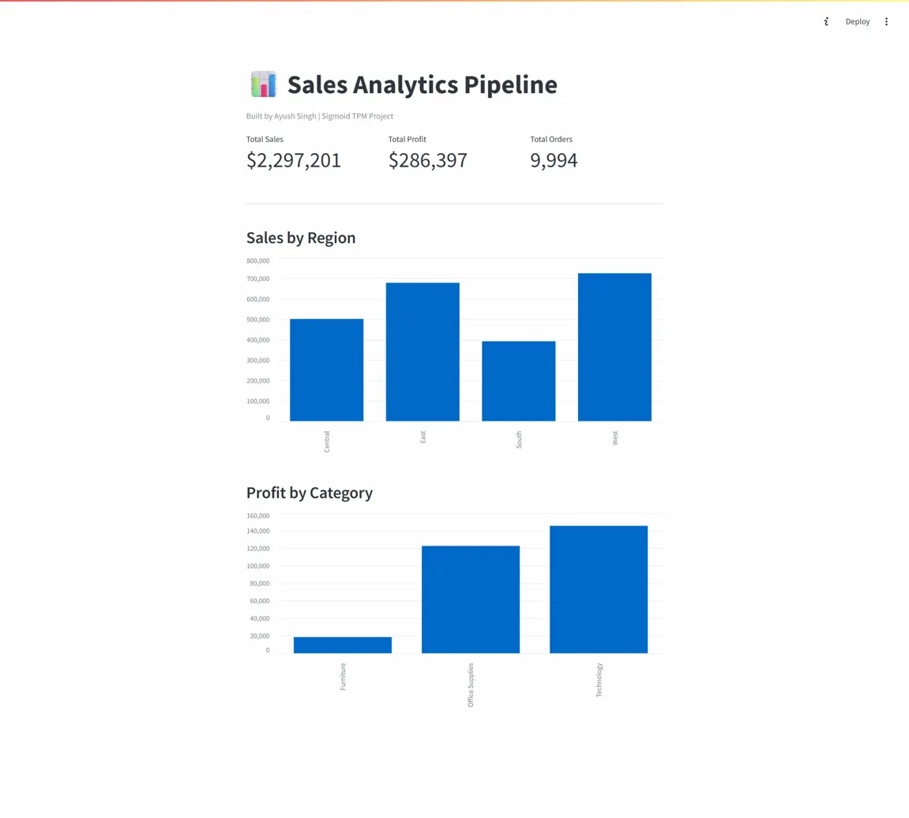

# Sales Analytics Pipeline

An end-to-end data pipeline that ingests, cleans, stores and visualizes 
retail sales data — built to demonstrate core data engineering concepts.

## Architecture
Raw CSV -> Python Cleaning -> SQLite Database -> SQL Queries -> Streamlit Dashboard

## Dashboard

## How to Run
1. Install dependencies: `pip install pandas streamlit matplotlib seaborn`
2. Run the full pipeline: `python pipeline.py`
3. Launch dashboard: `streamlit run app.py`

## Tech Stack
- Python + Pandas (data cleaning)
- SQLite (data warehouse)
- Streamlit (dashboard)
- GitHub Actions (automated CI/CD)

## Key Learnings
- Built an automated ETL pipeline from scratch
- Modelled a data warehouse using SQL
- Automated pipeline runs using GitHub Actions CI/CD
- Visualized business KPIs for stakeholder consumption
